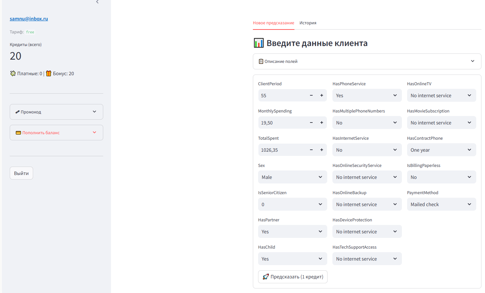
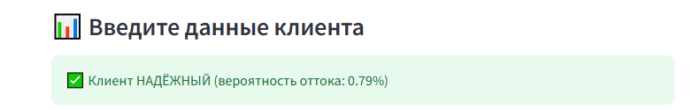
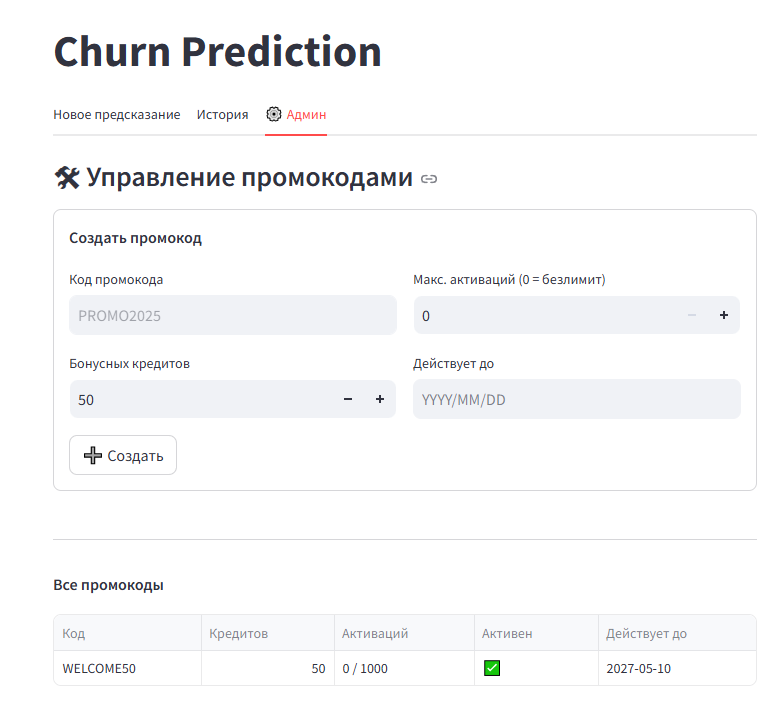
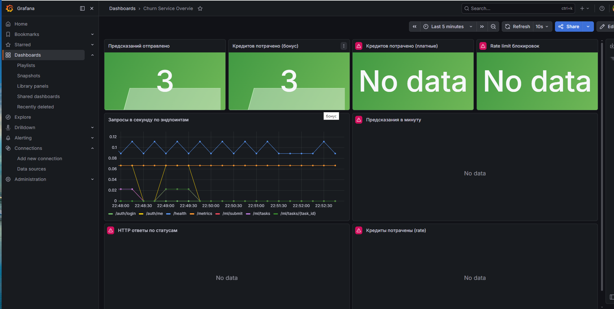

# Churn Prediction Service

ML-сервис предсказания оттока клиентов с биллингом, JWT, Celery и мониторингом. 
Предсказание работает на SGDClassifier. Описание полей:
        ("ClientPeriod", "Сколько месяцев клиент с нами", "0..72"),
        ("MonthlySpending", "Ежемесячные траты", "float"),
        ("TotalSpent", "Всего потрачено", "float"),
        ("Sex", "Пол", "Male / Female"),
        ("IsSeniorCitizen", "Пенсионер", "0 / 1"),
        ("HasPartner", "Есть партнёр", "Yes / No"),
        ("HasChild", "Есть ребёнок", "Yes / No"),
        ("HasPhoneService", "Телефония", "Yes / No"),
        ("HasMultiplePhoneNumbers", "Несколько номеров", "Yes / No / No phone service"),
        ("HasInternetService", "Тип интернета", "DSL / Fiber optic / No"),
        ("HasOnlineSecurityService", "Онлайн-безопасность", "Yes / No / No internet service"),
        ("HasOnlineBackup", "Онлайн-бэкап", "Yes / No / No internet service"),
        ("HasDeviceProtection", "Защита устройства", "Yes / No / No internet service"),
        ("HasTechSupportAccess", "Техподдержка", "Yes / No / No internet service"),
        ("HasOnlineTV", "ТВ", "Yes / No / No internet service"),
        ("HasMovieSubscription", "Кино-подписка", "Yes / No / No internet service"),
        ("HasContractPhone", "Тип контракта", "Month-to-month / One year / Two year"),
        ("IsBillingPaperless", "Безбумажный биллинг", "Yes / No"),
        ("PaymentMethod", "Способ оплаты", "Electronic check / Mailed check / Bank transfer / Credit card")

Реализован простой вариант (А) с системой промокодов.
Стоимость 1 предикта - 1 кредит. Сперва списываются промо.
При регистрации у всех тариф free. Далее с участием админа можно поменять тариф на basic, pro (различаются стоимостью и числом запросов в минуту)

Панель пользователя: 
Прелсказания: 
Админка: 
Grafana: 

## Быстрый старт

docker compose up -d --build

При сборке образа автоматически:
- модель обучается на `data/train.csv`
- при первом запуске создаётся админ и промокод WELCOME50. Далее промокоды можно менять под админской учеткой в streamlit.

## Интерфейсы

| URL | Что | Логин / пароль |
|-----|-----|---------------|
| http://localhost:8501 | **Streamlit** — предсказания | регистрация или admin@gmail.com / admin12345 |
| http://localhost:8000/docs | **Swagger** — документация API | — |
| http://localhost:3000 | **Grafana** — дашборды | admin / admin |
| http://localhost:9090 | **Prometheus** — метрики | — |

## Секреты

Все пароли в `.env` файле. Шаблон — `.env.example`.

## Тесты

docker compose exec app pytest

33 теста, покрытие 77%.

## Бизнес-план

[docs/BUSINESS_PLAN.md](docs/BUSINESS_PLAN.md)

## Структура

ml-service/
├── app/                        # FastAPI
│   ├── api/                    # auth, predictions, promo
│   ├── core/                   # config, security, limiter, metrics
│   ├── db/                     # модели БД
│   ├── ml/                     # модель, preprocessing
│   ├── services/               # billing, promo
│   ├── tasks/                  # Celery worker
│   └── main.py
├── data/
│   └── train.csv               # ← данные для обучения
├── images/                     # интерфейс
├── models/                     # обученная модель (создаётся при build)
├── streamlit_app/app.py        # веб-интерфейс
├── monitoring/                 # prometheus + grafana
├── scripts/                    # seed.py, train_model.py
├── tests/                      # pytest (33 теста)
├── docs/BUSINESS_PLAN.md       # бизнес-план
├── docker-compose.yml
├── Dockerfile
├── entrypoint.sh
├── .env / .env.example
└── requirements.txt
